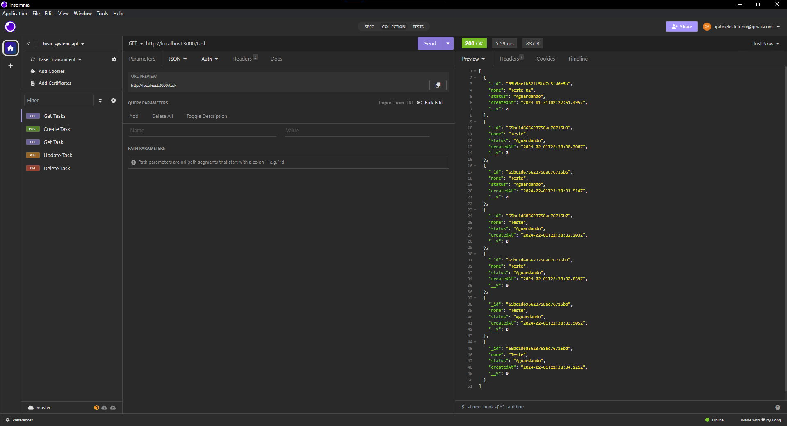
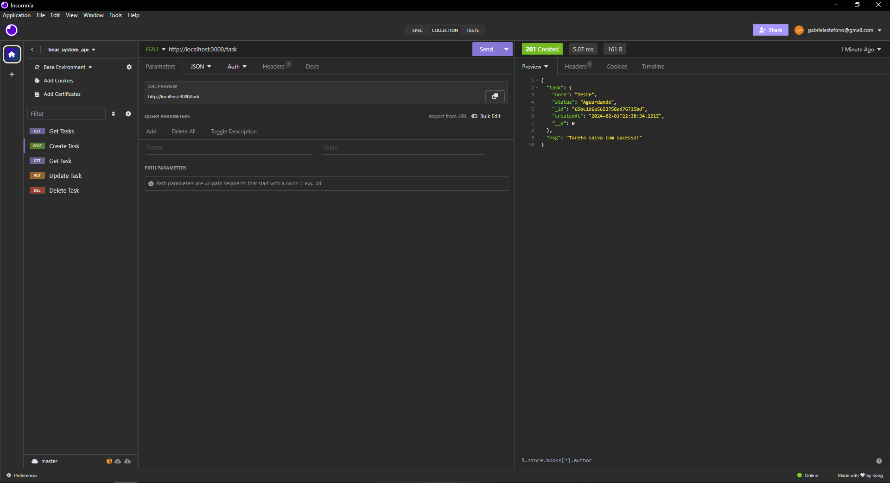
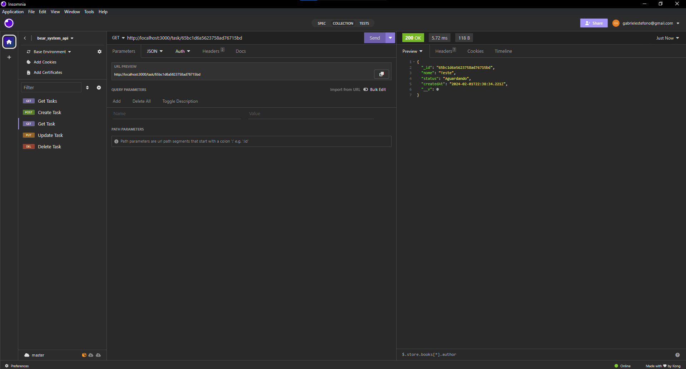
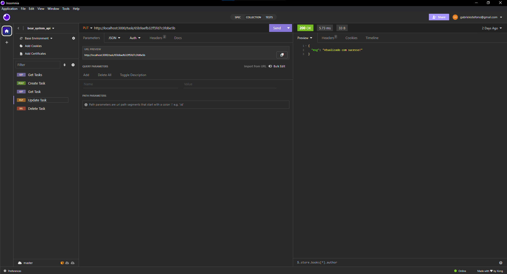
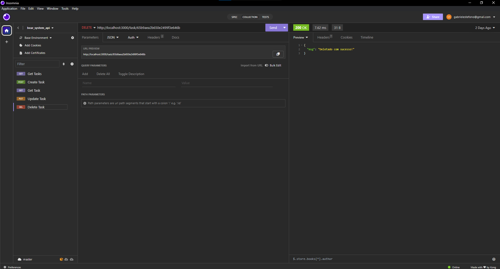

# Documentação da API de Tarefas

## Descrição Geral

Esta API fornece um conjunto de operações para criar, recuperar, atualizar e deletar tarefas. Ela foi construída usando o framework Express.js e é destinada para estudos e gerenciamento de tarefas.

## Endpoints e Métodos

### Listar Tarefas (Index)

**Endpoint:** GET /task
**Descrição:** Retorna uma lista de todas as tarefas.
#### Resposta:
Um array de objetos de tarefas, onde cada tarefa contém id, título, descrição, etc.

### Criar Tarefa (Store)

**Endpoint:** POST /task
**Descrição:** Cria uma nova tarefa.

#### Parâmetros de Corpo (Body):
* title (String) - O título da tarefa.
* description (String) - Descrição da tarefa.
* Outros campos conforme necessário.
#### Resposta: 
Objeto da tarefa criada, incluindo seu id, título, descrição, etc.

### Obter Tarefa (Show)

**Endpoint:** GET /task/:id
**Descrição:** Retorna detalhes de uma tarefa específica.

#### Parâmetros de URL:
* id (Number) - ID da tarefa.
#### Resposta: 
Objeto da tarefa solicitada, incluindo id, título, descrição, etc.

### Atualizar Tarefa (Update)

**Endpoint:** PUT /task/:id
**Descrição:** Atualiza uma tarefa existente.

#### Parâmetros de URL:
* id (Number) - ID da tarefa a ser atualizada.
#### Parâmetros de Corpo (Body):
* Campos a serem atualizados, como title (String) e description (String).
#### Resposta: 
Objeto da tarefa atualizada, incluindo as novas informações.

### Deletar Tarefa (Delete)

**Endpoint:** DELETE /task/:id
**Descrição:** Remove uma tarefa específica.
#### Parâmetros de URL:
* id (Number) - ID da tarefa a ser removida.
#### Resposta: 
Mensagem de sucesso ou erro indicando o resultado da operação.

## Imagens

- 01 - Listar Tarefas

- 02 - Criar Tarefa

- 03 - Obter Tarefa

- 04 - Atualizar Tarefa

- 05 - Deletar Tarefa
